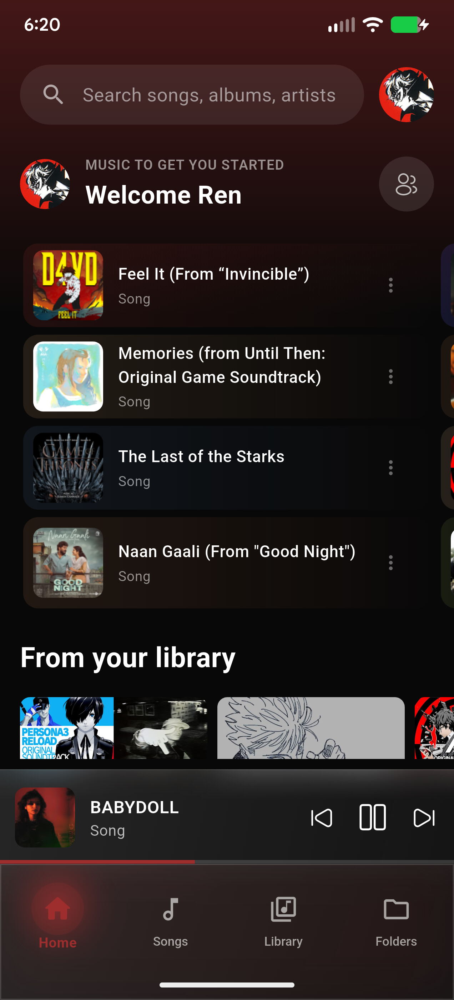
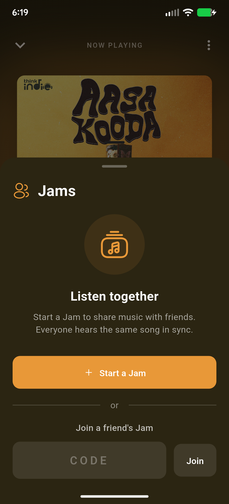
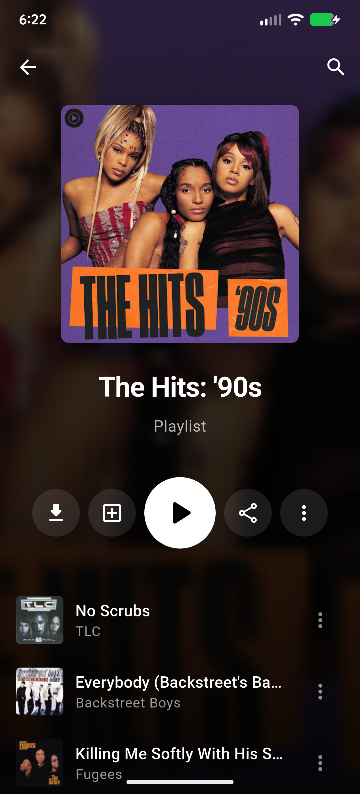
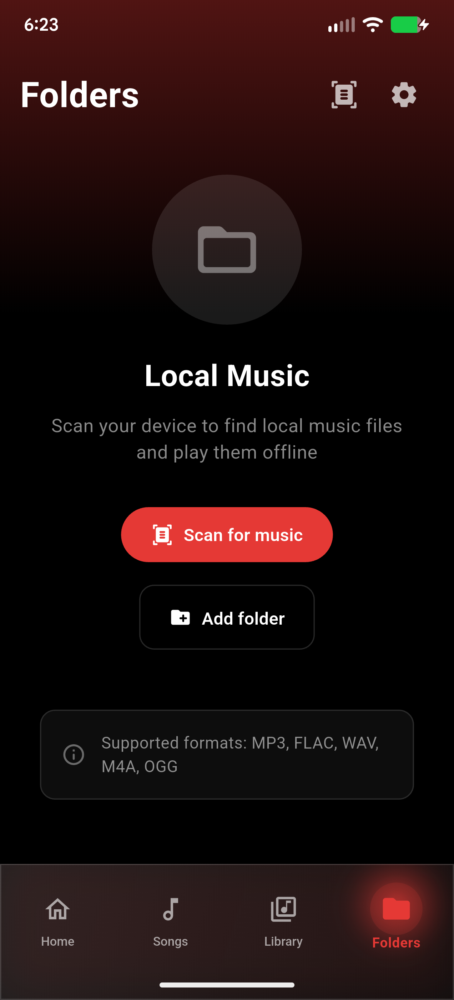
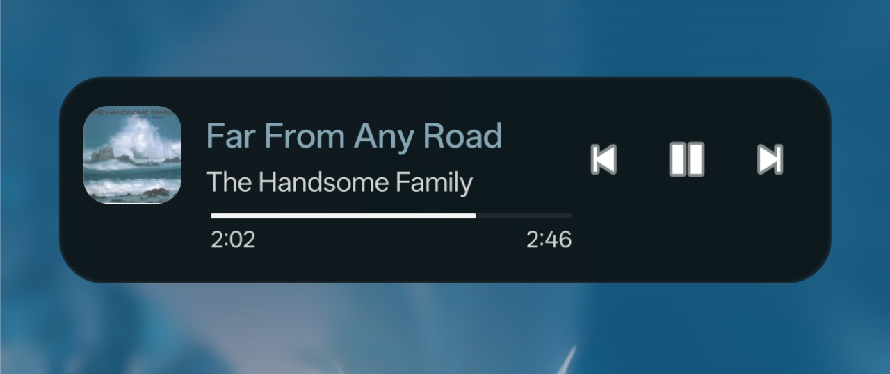
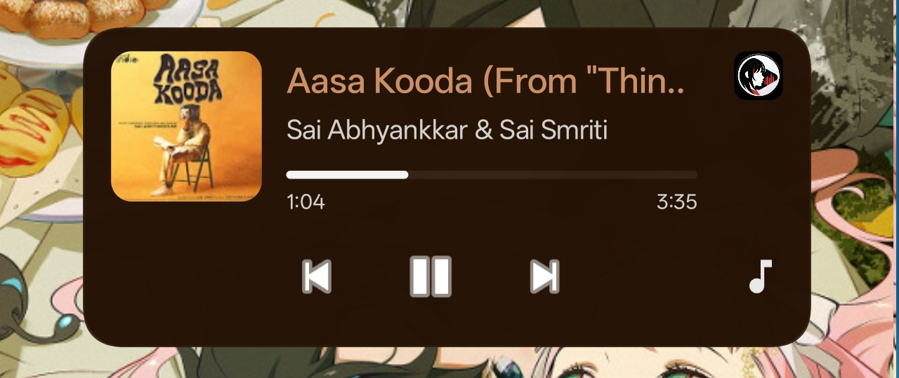

<div align="center">
	
<h1>Inzx</h1>

*A modern YouTube Music client with dynamic theming and real-time Jam sessions*

[](https://flutter.dev)
[](https://dart.dev)
[](LICENSE)


[Features](#features) • [Screenshots](#screenshots) • [Installation](#installation) • [Development](#development) • [Contributing](#contributing)


</div>

> [!WARNING]
> Inzx is only available on the platforms listed here. It is not on the Play Store or any other websites claiming to provide official releases.  
> 
> If we ever publish Inzx on any additional platforms, it will be announced and updated here. Please avoid downloading unofficial or modified versions for your safety.

<div align="center">

[](https://apps.obtainium.imranr.dev/redirect?r=obtainium://add/https://github.com/nirmaleeswar30/Inzx/)⠀
[](https://github.com/nirmaleeswar30/Inzx/releases/latest)⠀⠀

</div>

## Features

### 🎧 Music Playback
- **YouTube Music Integration** - Stream millions of songs from YouTube Music
- **Offline-First Architecture** - Smart caching for seamless offline playback
- **Background Playback** - Full media controls with notification support
- **Audio Session Management** - Proper audio focus handling
- **Gapless Playback** - Smooth transitions between tracks

### 🎨 Beautiful UI
- **Material Design 3** - Modern, clean interface with dynamic theming
- **Dynamic Colors** - Adaptive colors extracted from album artwork
- **Dark/Light Mode** - Automatic theme switching
- **Multi-language UI** - Built-in localization with app language and content region controls
- **Smooth Animations** - Fluid transitions and micro-interactions
- **Album Art Visualization** - Stunning now-playing screen with palette-based theming
- **Lyrics Preview** - Focused lyrics display with real time with song

### 👥 Collaborative Listening (Jams)
- **Real-time Sync** - Listen together with friends in real-time
- **Host & Participant Roles** - Granular permission control
- **Shared Queue** - Collaborative queue management
- **Live Playback Sync** - Automatic position and state synchronization
- **"Last Controller Wins"** - Intelligent conflict resolution for multi-user control

### 📚 Music Library
- **YouTube Music Integration** - Access your YT Music library, playlists, and liked songs
- **Local Files Support** - Play music from device storage
- **Smart Playlists** - Create and manage custom playlists
- **Download Management** - Download tracks for offline playback
- **Search & Discovery** - Powerful search with filters and recommendations

### 🔒 Privacy & Security
- **Offline-First** - Works without internet connection
- **Secure Storage** - Encrypted credentials storage
- **No Tracking** - Your listening habits stay private
- **Optional Cloud Sync** - Choose when to connect


## Screenshots

<div align="center">
<table>
<tr>
<td align="center" width="25%">

<br/><b>Home</b>
</td>
<td align="center" width="25%">

<br/><b>Now Playing</b>
</td>
<td align="center" width="25%">

<br/><b>Library</b>
</td>
<td align="center" width="25%">

<br/><b>Jams</b>
</td>
</tr>
<tr>
<td align="center" width="25%">

<br/><b>Search</b>
</td>
<td align="center" width="25%">

<br/><b>Playlist</b>
</td>
<td align="center" width="25%">

<br/><b>Folders</b>
</td>
<td align="center" width="25%">

<br/><b>Lyrics</b>
</td>
</tr>
<table>
<tr>
<td align="center" width="50%">

<br/><b>Widget 4x1</b>
<td align="center" width="50%">

<br/><b>Widget 4x2</b>
</tr>
</table>
</table>
</div>

## Installation

#### Download from Github Releases
Download the latest release from the [Releases](../../releases) page.

#### Installation via ADB Commands
```bash
adb install app-release.apk
```

## Building from Source

### Prerequisites
- **Flutter SDK** (3.10.3 or higher)
- **Dart SDK** (3.10.3 or higher)
- **Android Studio** or **VS Code** with Flutter extensions
- **Android SDK** (for Android builds)
- **Git**

### Setup

1. **Clone the repository**
   ```bash
   git clone https://github.com/nirmaleeswar30/Inzx.git
   cd Inzx
   ```

2. **Install dependencies**
   ```bash
   flutter pub get
   ```

3. **Run code generation** (for Riverpod providers and localization files)
   ```bash
   dart run build_runner build --delete-conflicting-outputs
   flutter gen-l10n
   ```
   - `lib/l10n/generated/` is generated locally from the tracked ARB files and does not need to be committed.

4. **Configure Environment Variables**
   - Create a `.env` file in the root directory:
     ```bash
     cp .env.example .env
     ```

5. **Configure Supabase** (for Jams feature)
   - Create a Supabase project at [supabase.com](https://supabase.com)
   - Enable Realtime in your Supabase project settings
   - Update `SUPABASE_URL` and `SUPABASE_ANON_KEY` in your `.env` file

6. **Configure Google Sign-In** (for Jams user profiles)
   - Go to [Google Cloud Console](https://console.cloud.google.com)
   - Create a new project or select an existing one
   - Navigate to **APIs & Services > Credentials**
   - Create an **OAuth 2.0 Client ID**:
     - For Android: Select "Android" and add your app's package name and SHA-1 fingerprint
     - For Web (required for Android server auth): Select "Web application"
   - Update `GOOGLE_WEB_CLIENT_ID` in your `.env` file with the **Web Client ID**
   
   > **Note:** The app uses the `google_sign_in` package standalone for basic user profile info in Jams.

6. **Add your app icons and splash screen** (optional)
   - Use 1024x1024 pixel png iages and place them inside assets/icon for custom app icons and assets/splash for custom splash screen during app starts. 
   - Then run the following:
   ```bash
      dart run flutter_launcher_icons 
      dart run flutter_native_splash:create 
   ```   
### Run in Development

```bash
# Run on connected device
flutter run

# Run in release mode
flutter run --release
```

### Build for Production

```bash
# Build APK
flutter build apk --release

# Build App Bundle (for Play Store)
flutter build appbundle --release

# Build with split APKs per ABI (smaller file sizes)
flutter build apk --split-per-abi --release
```

Output files:
- APK: `build/app/outputs/flutter-apk/app-release.apk`
- App Bundle: `build/app/outputs/bundle/release/app-release.aab`

### Testing

```bash
# Run all tests
flutter test

# Run with coverage
flutter test --coverage

# Run integration tests
flutter drive --target=test_driver/app.dart
```

## Architecture

### 🏗️ Tech Stack

#### Core
- **Flutter** - UI framework
- **Dart** - Programming language
- **Riverpod** - State management with code generation

#### Data & Storage
- **Hive** - Fast, lightweight NoSQL database for caching
- **Flutter Secure Storage** - Encrypted credentials storage
- **Supabase** - Real-time backend for Jams feature
- **Shared Preferences** - Local settings storage

#### Audio
- **just_audio** - Advanced audio playback
- **audio_service** - Background playback and media controls
- **audio_session** - Audio focus and session management
- **youtube_explode_dart** - YouTube stream extraction

#### UI & Design
- **Dynamic Theming** - Dynamic color theming based on active album art
- **Iconsax** - Beautiful icon set
- **Cached Network Image** - Optimized image loading
- **Palette Generator** - Dynamic color extraction from artwork
- **Widget Support** - Dynamic widget support with progress indicator and controls

#### Features
- **Google Sign-In** - YouTube Music authentication
- **WebView** - YT Music cookie-based login
- **Permission Handler** - Runtime permissions
- **File Picker** - Local file access
- **Share Plus** - Content sharing
- **Flutter Local Notifications** - Download progress notifications

### 📁 Project Structure

```
lib/
├── main.dart                      # App entry point
├── core/
│   ├── design_system/             # Reusable UI components
│   ├── layout/                    # Layout templates
│   ├── providers/                 # Core providers
│   ├── router/                    # Navigation
│   ├── services/                  # Core services
│   │   ├── audio_player_service.dart
│   │   ├── supabase_service.dart
│   │   └── ...
│   └── theme/                     # App theming
├── data/
│   ├── entities/                  # Data entities
│   ├── models/                    # Data models
│   ├── repositories/              # Data repositories
│   └── sources/                   # Data sources
├── models/                        # Business models
│   ├── track.dart
│   ├── album_artist_playlist.dart
│   └── ...
├── providers/                     # Feature providers
│   ├── music_providers.dart
│   ├── jams_provider.dart
│   └── ...
├── screens/                       # UI screens
│   ├── tabs/                      # Bottom nav tabs
│   ├── widgets/                   # Screen-specific widgets
│   └── ...
└── services/                      # Feature services
    ├── jams/                      # Jams (collaborative listening)
    │   ├── jams_service_supabase.dart
    │   ├── jams_sync_controller.dart
    │   └── jams_models.dart
    ├── download_service.dart
    └── ...
```


## Key Features Explained

### 👥 Jams (Collaborative Listening)

Jams allows multiple users to listen to music together in real-time with synchronized playback.

**How it works:**
- **Supabase Realtime** — WebSocket-based real-time communication
- **JamsSyncController** — Bidirectional sync between host and participants
- **Conflict Resolution** — "Last controller wins" strategy
- **Permission System** — Host can grant control to specific participants

**What's supported:**
- [x] Real-time playback synchronization (position, play/pause, track changes)
- [x] Shared queue with drag-to-reorder
- [x] Auto-fetch radio tracks when queue runs low
- [x] Multiple controllers with permission-based access
- [x] Drift correction for perfect sync across devices
- [x] Background synchronization

##

### 📶 Offline-First Architecture

Audio is streamed from YouTube and cached simultaneously, so tracks you've played before are available instantly — even without a connection.

**Caching strategy:**
1. Stream audio from YouTube while simultaneously caching
2. Automatically serve from cache on subsequent plays
3. Prioritize cached content when offline
4. Intelligent cache management to optimize storage

**Benefits:** instant playback of frequent tracks, reduced data usage, better battery life, and a seamless offline experience.

##

### 🎵 YouTube Music Integration

**Login methods:**
1. **Google Sign-In** — Standard OAuth flow
2. **Cookie-based** — WebView login for accounts with 2FA

**What you get access to:**
- Your full YT Music library
- Liked songs and playlists sync
- Personalized recommendations
- The entire YT Music search catalog

##

### 🌐 Multi-language Support

Inzx supports a localized app UI and locale-aware YouTube Music content requests.

**Supported app languages:**
- English
- Turkish
- Russian
- Hindi
- Tamil
- Kannada
- Telugu
- Spanish
- Portuguese (Brazil)
- French
- German
- Indonesian
- Japanese
- Korean
- Arabic
- Ukrainian
- Thai
- Chinese (Simplified)
- Chinese (Traditional)

**How it works:**
- **Localized app UI** — Navigation, settings, playback, library, dialogs, and other in-app surfaces use Flutter localization.
- **Locale-aware YT Music data** — Server-fetched labels and related content follow the selected app language when YouTube Music provides localized responses.
- **Separate language and content location** — App language and recommendation/catalog region can be configured independently, similar to YouTube Music.
- **Searchable pickers** — Both language and content location use searchable pickers in Settings.

> [!NOTE]
> Newly added locales are fully wired into the app, but some languages may still benefit from native-speaker wording polish for the most natural music-related terminology.

## Development

### 🐛 Known Issues

- [x] ~~No Background sync for jams~~
- [x] ~~No Widget support (yet)~~


### 📝 Roadmap

- [x] ~~**Crossfade** - Smooth transitions between tracks~~
- [ ] **Android Auto** - Car integration
- [ ] **Chromecast support** - Cast to speakers
- [ ] **Desktop support** - Windows, macOS, Linux builds
- [ ] **AI DJ Integration** - Suggest albums, music, and playlists based on user's preferences and prompts

## Acknowledgments

- [OuterTune](https://github.com/OuterTune/OuterTune) - Kotlin based client
- [Flutter](https://flutter.dev) - Amazing UI framework
- [just_audio](https://pub.dev/packages/just_audio) - Excellent audio player
- [youtube_explode_dart](https://pub.dev/packages/youtube_explode_dart) - YouTube stream extraction
- [Supabase](https://supabase.com) - Real-time backend infrastructure
- [Iconsax](https://iconsax.io) - Beautiful icon set

## Contributing

Contributions are welcome! Whether it is opening an issue, bug fixes, new features, documentation improvements or document translations — all help is appreciated.

Please read the [Contributing Guide](CONTRIBUTING.md) before getting started.

## License

This project is licensed under the [MIT License](LICENSE)

---

<div align="center">

**Made with ❤️ and Flutter**

⭐ Star this repo if you like it!

<p>
  <a href="../../issues">Open an Issue</a> • 
  <a href="../../discussions">Start a Discussion</a>
</p>

</div>
