<div align="center">
	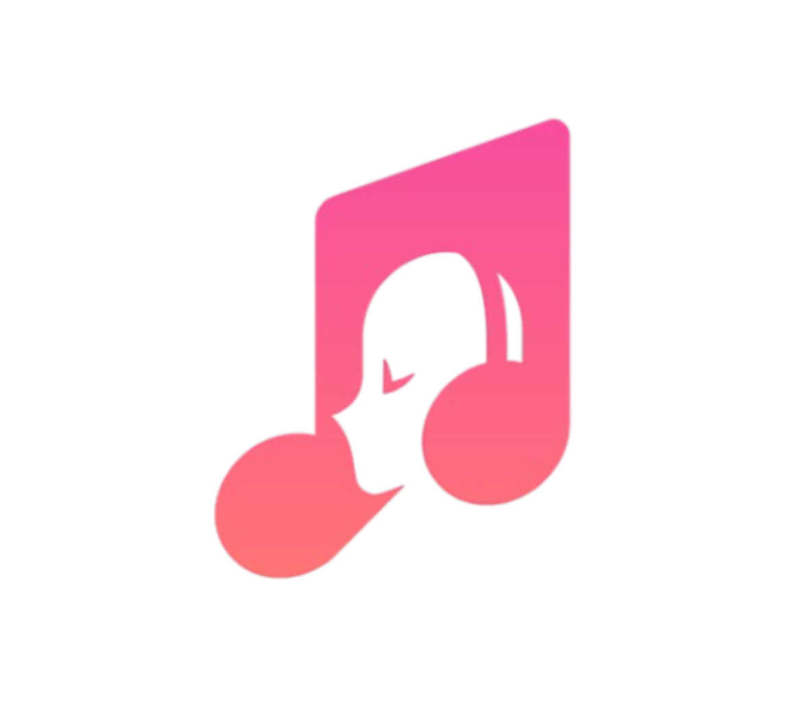
<h1>Inzx</h1>

*A modern YouTube Music client with dynamic theming, word-level synced lyrics, and real-time Jam sessions*

[](https://flutter.dev)
[](https://dart.dev)
[](LICENSE)


[Features](#features) • [Screenshots](#screenshots) • [Installation](#installation) • [Development](#development) • [Contributing](#contributing)


</div>

> [!WARNING]
> Inzx is only available on the platforms listed here. It is not on the Play Store or any other websites claiming to provide official releases.  
> 
> If we ever publish Inzx on any additional platforms, it will be announced and updated here. Please avoid downloading unofficial or modified versions for your safety.

<div align="center">

[](https://apps.obtainium.imranr.dev/redirect?r=obtainium://add/https://github.com/nirmaleeswar30/Inzx/)⠀
[](https://github.com/nirmaleeswar30/Inzx/releases/latest)⠀⠀

</div>

## ❤️ Sponsors

If you enjoy using Inzx, consider supporting the development!
Your support helps keep the project alive and actively maintained.

[](https://github.com/sponsors/nirmaleeswar30)

## Features

### 🎧 Music Playback
- **YouTube Music Integration** — Native InnerTube API engine for streaming millions of songs, playlists, albums, and artists
- **Offline-First Architecture** — Intelligent caching for instant playback and offline listening
- **Background Playback** — Full media notification controls and Android media session support
- **Android Auto Support** — Native dashboard integration for safe in-car playback
- **Audio Session Management** — Seamless audio focus, phone call handling, and crossfade support
- **Gapless Playback & Stream Prefetching** — OuterTune-style prefetching for 0ms play latency

### 🎨 Beautiful UI & Skeleton Loaders
- **Material Design 3** — Clean, modern design system built for performance
- **Skeletonizer Loading** — Smooth shimmer skeleton loaders across all main tabs and detail pages
- **Instant Dynamic Colors** — 0ms album artwork color extraction with Hive & memory RAM caching
- **Synced & Word-Level Lyrics** — High-precision word-level karaoke sync powered by BetterLyrics, LRCLib, YouTube Captions, and Genius
- **Multi-language UI** — App UI localization and independent YouTube Music catalog region controls
- **Full-Screen Now Playing & Stage View** — Interactive player with responsive layouts and fluid transitions

### 👥 Collaborative Listening (Jams)
- **Real-time Sync** — Listen together with friends in real-time powered by Supabase WebSockets
- **Host & Participant Roles** — Granular permission control and participant management
- **Shared Queue** — Collaborative queue editing and drag-to-reorder
- **Live Playback Sync** — Position and state synchronization with drift correction
- **"Last Controller Wins"** — Smart conflict resolution for multi-user control

### 📚 Music Library & Downloads
- **YouTube Music Sync** — Access your saved playlists, liked songs, albums, and subscribed artists
- **Local Device Files** — Scan and play local music files from device storage
- **Custom Playlists** — Create and manage custom local playlists
- **Download Manager** — Download tracks for offline playback with background progress tracking
- **Dynamic Search** — Instant search with suggestions, history, and category filters

### 🔒 Privacy & Security
- **Offline-First** — Fully functional without continuous network connectivity
- **Secure Credentials** — Encrypted local storage for auth tokens
- **No Tracking** — Private listening without analytics telemetry

---

## Screenshots

<div align="center">

| **Home** | **Now Playing** | **Library** | **Jams** |
|:---:|:---:|:---:|:---:|
| 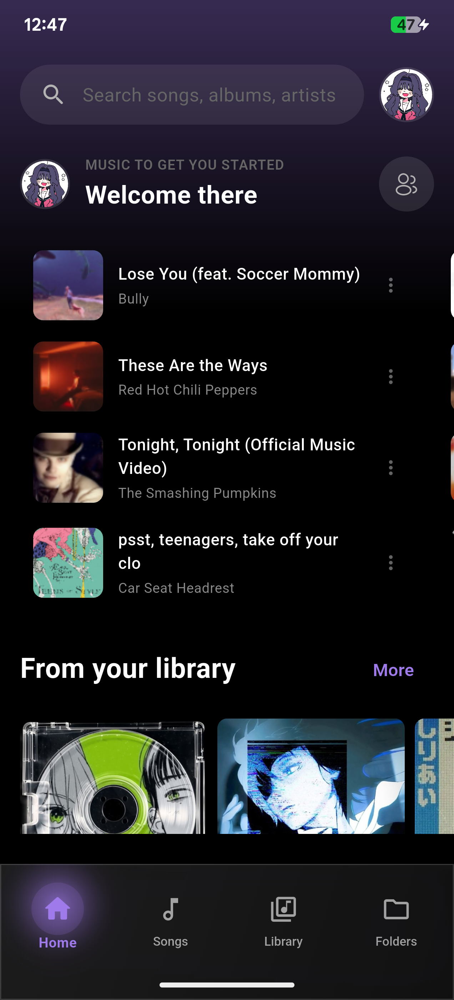 | 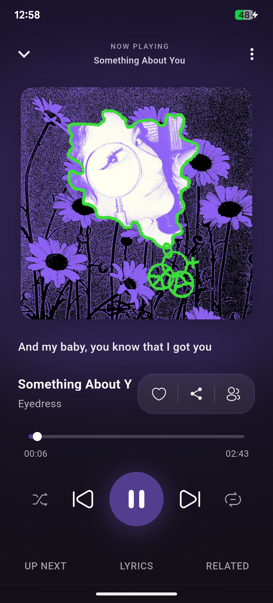 | 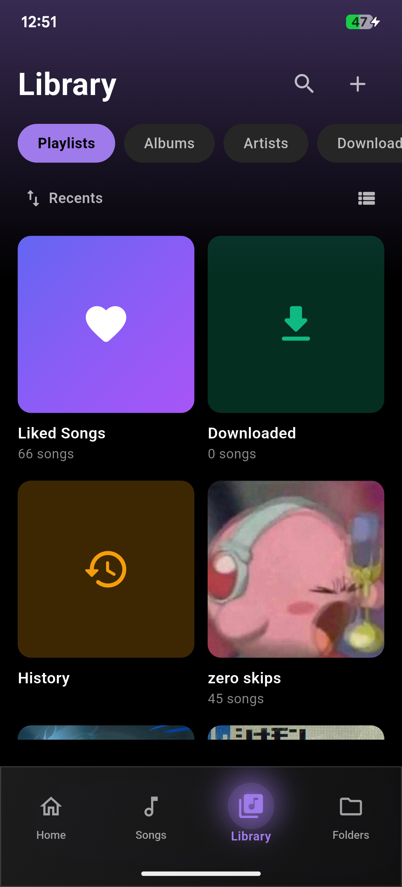 | 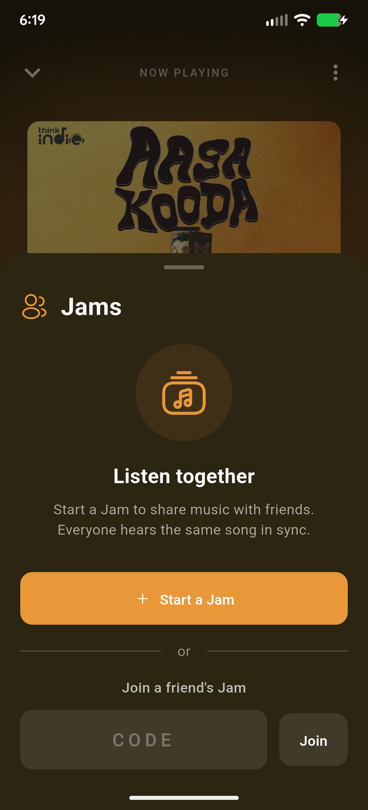 |
| **Search** | **Playlist** | **Folders** | **Lyrics** |
| 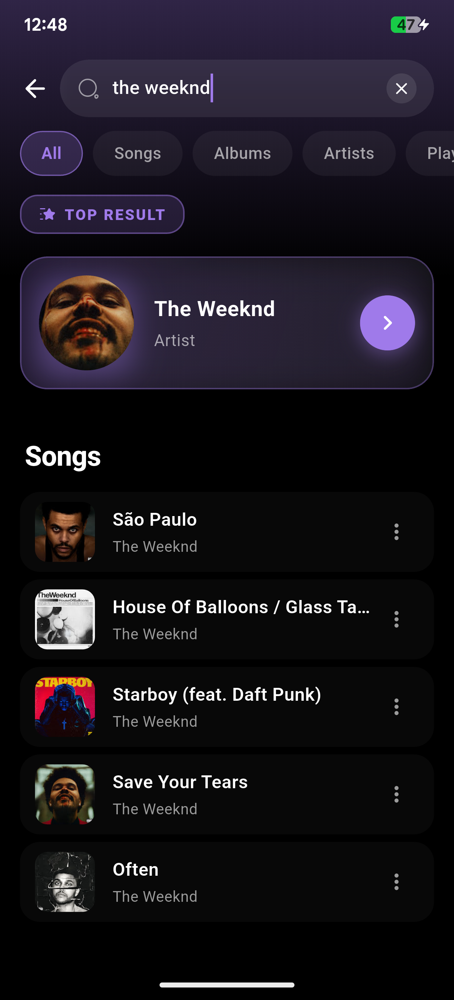 | 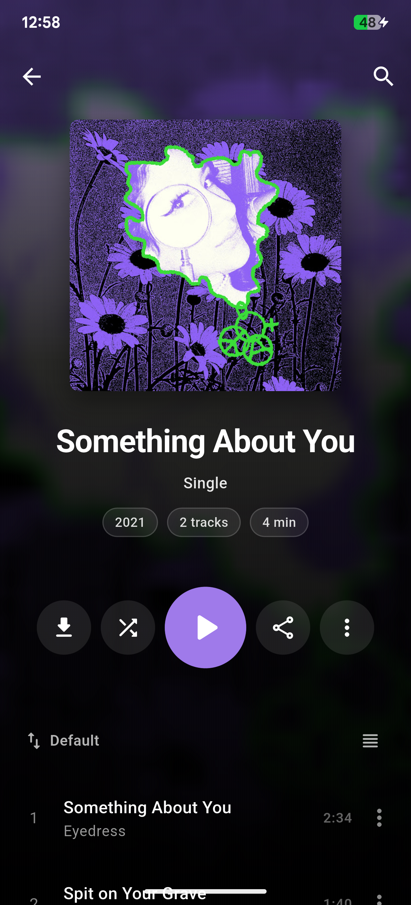 | 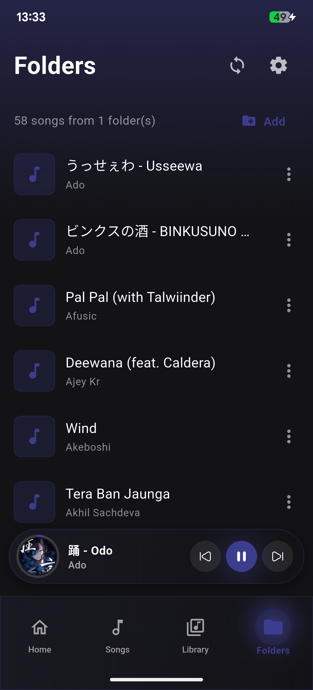 | 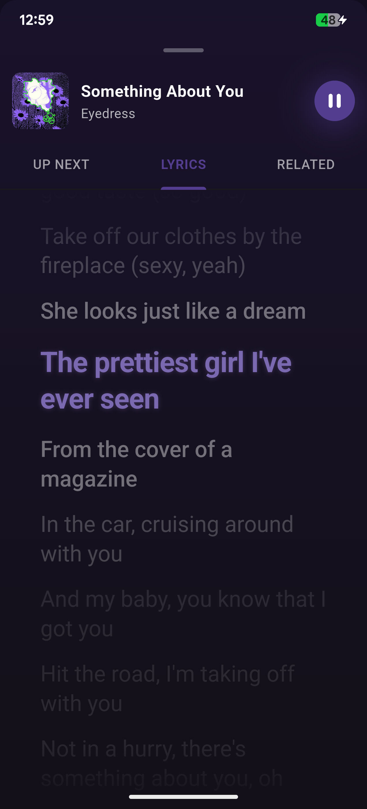 |

</div>

<table width="100%">
<tr>
<th align="center">Better Lyrics</th>
</tr>
<tr>
<td align="center">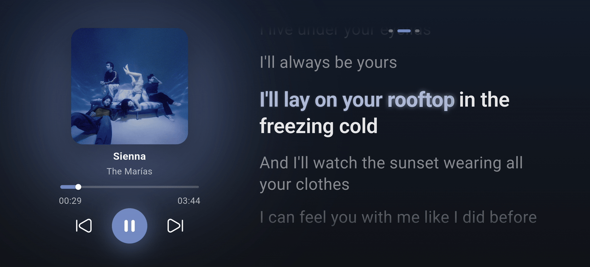</td>
</tr>
</table>


<div align="center">

| **Widget 4x1** | **Widget 4x2** |
|:---:|:---:|
| 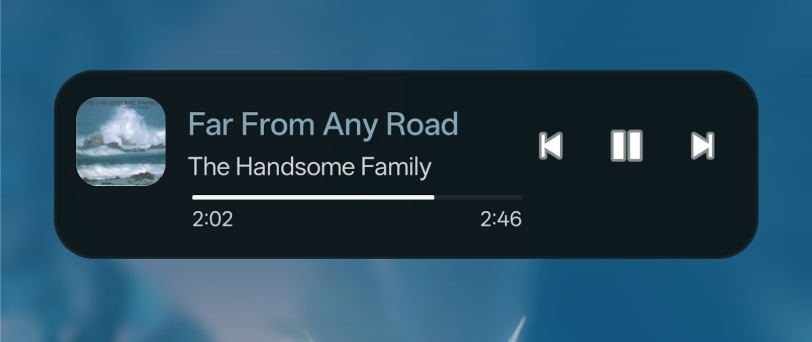 | 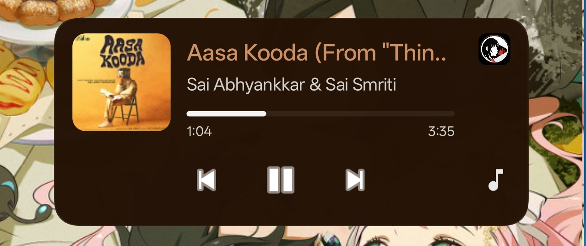 |

| **Android Auto** | **Android Auto - Now Playing** |
|:---:|:---:|
| 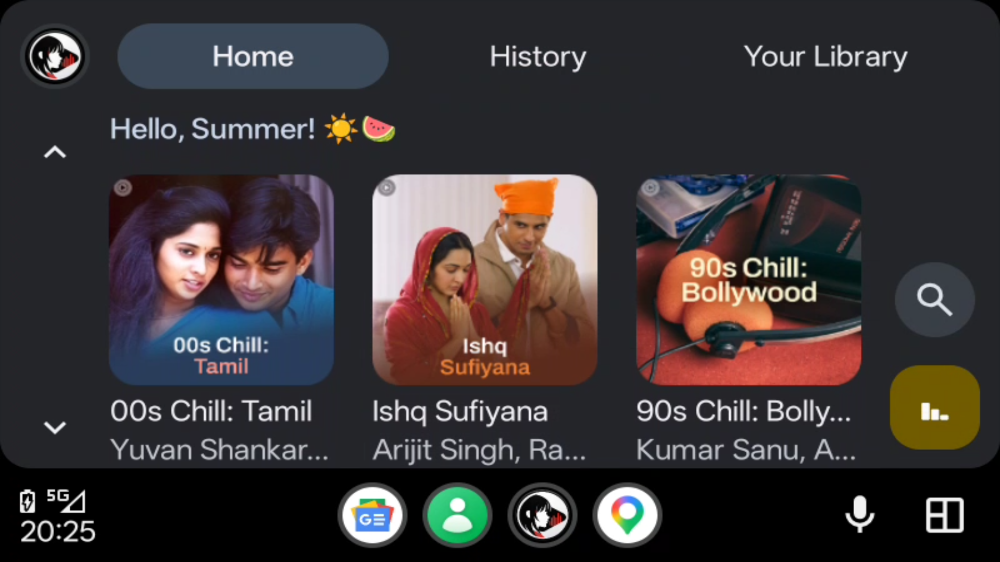 | 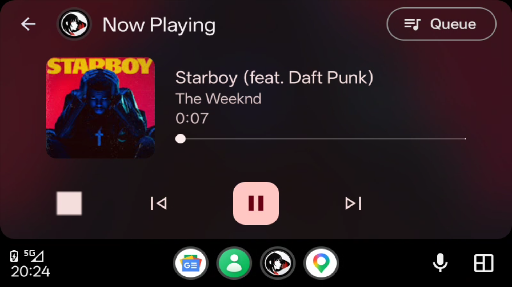 |

</div>

---

## Installation

#### Download from GitHub Releases
Download the latest release APK from the [Releases](../../releases) page.

#### Installation via ADB
```bash
adb install app-release.apk
```

---

## Building from Source

### Prerequisites
- **Flutter SDK** (3.10.3 or higher)
- **Dart SDK** (3.10.3 or higher)
- **Android Studio** or **VS Code** with Flutter extensions
- **Android SDK** (for Android builds)
- **Git**

### Setup

1. **Clone the repository**
   ```bash
   git clone https://github.com/nirmaleeswar30/Inzx.git
   cd Inzx
   ```

2. **Install dependencies**
   ```bash
   flutter pub get
   ```

3. **Run code generation**
   ```bash
   dart run build_runner build --delete-conflicting-outputs
   flutter gen-l10n
   ```

4. **Configure Environment Variables**
   - Create a `.env` file in the root directory:
     ```bash
     cp .env.example .env
     ```

5. **Configure Supabase** (for Jams feature)
   - Create a Supabase project at [supabase.com](https://supabase.com)
   - Enable Realtime in your Supabase project settings
   - Update `SUPABASE_URL` and `SUPABASE_ANON_KEY` in your `.env` file

6. **Configure Google Sign-In** (for Jams user profiles)
   - Create an OAuth 2.0 Web Client ID on Google Cloud Console
   - Update `GOOGLE_WEB_CLIENT_ID` in your `.env` file

### Build Commands

```bash
# Run in debug mode
flutter run

# Build release APK
flutter build apk --release

# Build split APKs per ABI
flutter build apk --split-per-abi --release
```

---

## Architecture & Tech Stack

### 🏗️ Tech Stack

#### Core Framework
- **Flutter** — UI framework
- **Dart** — Language
- **Riverpod** — State management with code generation

#### Data & Storage
- **Hive** — Fast NoSQL database for local caching of tracks, playlists, and colors
- **Flutter Secure Storage** — Encrypted storage for credentials
- **Supabase** — Real-time WebSockets backend for Jams
- **Shared Preferences** — App configuration & settings

#### Audio & InnerTube API
- **InnerTube API Engine** — Direct API integration for YouTube Music catalog, playback streams, shelves, and metadata
- **just_audio** — Audio player engine with buffering and stream caching
- **audio_service** — Background media controls & notification integration
- **audio_session** — Audio focus management

#### UI & Design System
- **Skeletonizer** — Automatic shimmer skeleton loaders across all screens
- **AlbumColorExtractor** — Fast 0ms isolate-based palette color extraction
- **Iconsax** — Icon set
- **Cached Network Image** — Image caching & management
- **Marquee** — Scrolling text for long titles

---

## Multi-language Support

Inzx supports localized app UI and locale-aware YouTube Music content requests.

**Supported languages:**
English, Turkish, Russian, Hindi, Malayalam, Tamil, Kannada, Telugu, Spanish, Portuguese (Brazil), French, German, Indonesian, Japanese, Korean, Arabic, Ukrainian, Thai, Simplified Chinese, Traditional Chinese.

---

## Roadmap

- [x] **Crossfade** — Smooth transitions between tracks
- [x] **Android Auto** — Dashboard car integration
- [x] **Skeleton Loaders** — App-wide Skeletonizer loading placeholders
- [x] **Word-Level Synced Lyrics** — BetterLyrics TTML karaoke engine
- [ ] **Chromecast support** — Cast playback to external speakers
- [ ] **Desktop support** — Windows, macOS, Linux desktop targets

---

## Acknowledgments

- [OuterTune](https://github.com/OuterTune/OuterTune) — Kotlin music client design reference
- [Flutter](https://flutter.dev) — UI framework
- [just_audio](https://pub.dev/packages/just_audio) — Audio player package
- [Supabase](https://supabase.com) — Real-time infrastructure
- [BetterLyrics](https://github.com/nirmaleeswar30/Inzx) — Word-level synced lyrics API

---

## License

This project is licensed under the [MIT License](LICENSE).
