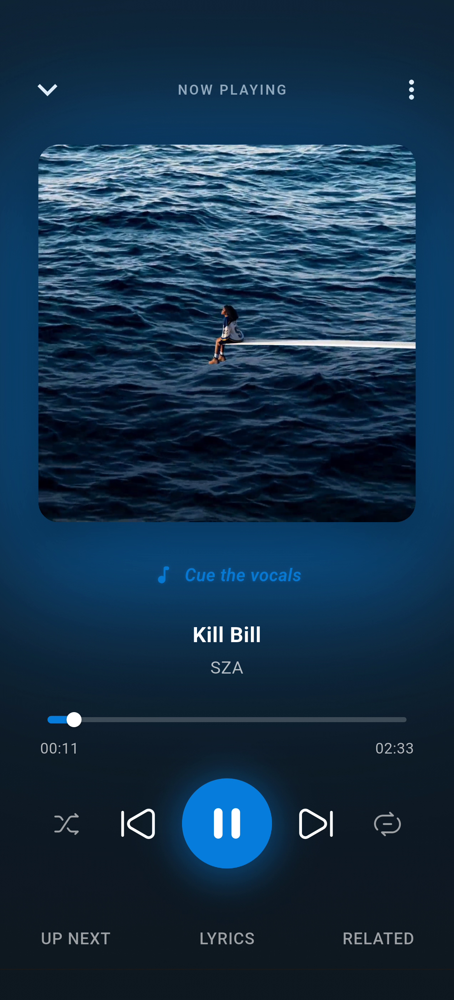
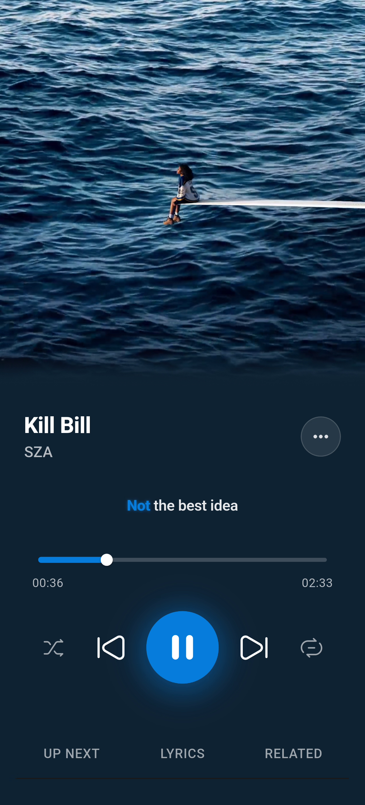
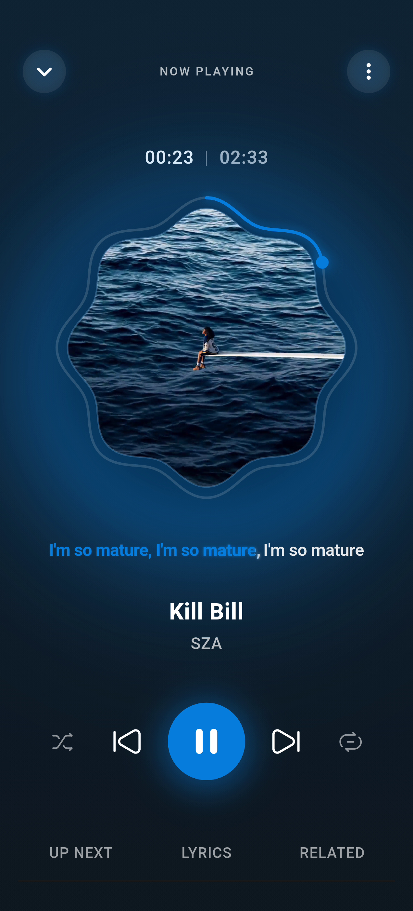
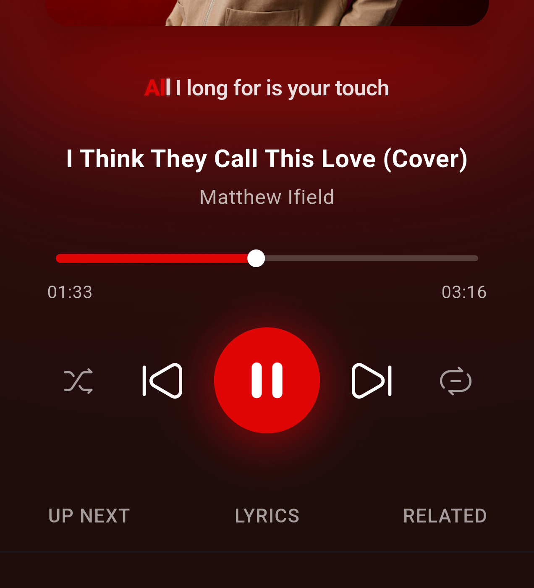
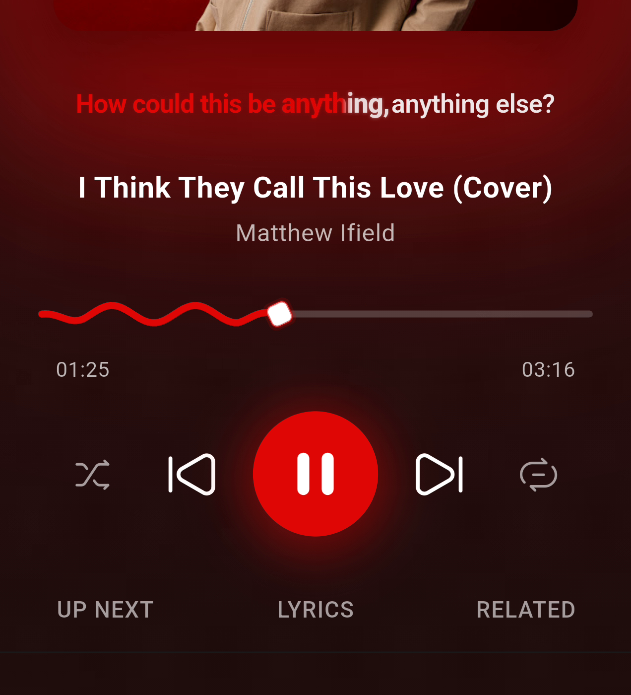
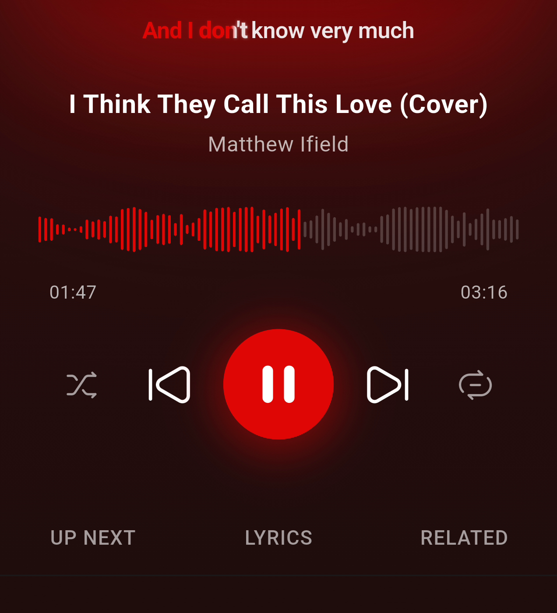

	
<h1>Inzx</h1>

*A modern YouTube Music client with dynamic theming, word-level synced lyrics, and real-time Jam sessions*

[Features](#features) • [Screenshots](#screenshots) • [Development](./DEVELOPMENT.md) • [Contributing](./CONTRIBUTING.md)

> [!WARNING]
> Inzx is only available on the platforms listed here and not available on the Play Store or any other site. Any future platforms will be announced here. 
> 
> Please avoid installing unofficial or modified versions of the app for your own safety.

⠀
⠀⠀

## ❤️ Sponsors

If you enjoy using Inzx, consider supporting the development!
Your support helps keep the project alive and actively maintained.

## Features

#### 🎧 Playback
- Stream millions of songs, playlists, albums, and artists via YouTube Music
- Background playback with full media notifications and Android Auto support
- Download & cache tracks for offline use
- Gapless playback with stream prefetching for 0ms latency
- Seamless audio focus, phone call handling, and crossfade support

#### 🎨 UI & Design
- App-wide dynamic theming that adapts to the currently playing album's cover art
- Multiple Now Playing screen styles (full-screen album art, cover view, ripple view) with choice of wavy, normal, or spectrum seekbars
- Live word-level synced karaoke lyrics from BetterLyrics, LRCLib, YouTube Captions, and Genius
- Localized app UI with locale-aware YouTube Music content, supporting 19+ languages
  
#### 📚 Library & Account
- Local file scanning and playback
- Sync saved playlists, liked songs, albums, and subscribed artists
- Custom local playlist creation, management, and drag-to-reorder queue editing

#### 👥 Collaborative Listening (Jams)
- Listen together with friends in real-time
- Host & participant roles with granular permission control
- Shared, collaboratively editable queue with drift-corrected playback sync

#### 🔒 Privacy & Security
- Fully functional without continuous network connectivity
- Encrypted local credential storage
- No analytics tracking

## Screenshots

| **Home** | **Now Playing** | **Library** | **Jams** |
|:---:|:---:|:---:|:---:|
|  |  |  |  |
| **Search** | **Playlist** | **Folders** | **Lyrics** |
|  |  |  |  |

<table width="100%">
<tr>
<th align="center">Better Lyrics</th>
</tr>
<tr>
<td align="center"></td>
</tr>
</table>

Alternative Styles

#### Now Playing Screen
<table>
<tr>
<th align="center" width="33%">Default</th>
<th align="center" width="33%">Cinematic</th>
<th align="center" width="33%">Ripple</th>
</tr>
<tr>
<td width="33%"></td>
<td width="33%"></td>
<td width="33%"></td>
</tr>
</table>

#### Seekbar Styles
<table>
<tr>
<th align="center" width="33%">Default</th>
<th align="center" width="33%">Waveform</th>
<th align="center" width="33%">Spectrum</th>
</tr>
<tr>
<td width="33%"></td>
<td width="33%"></td>
<td width="33%"></td>
</tr>
</table>

More Screenshots

| **Widget 4x1** | **Widget 4x2** |
|:---:|:---:|
|  |  |

| **Android Auto** | **Android Auto - Now Playing** |
|:---:|:---:|
|  |  |

---

## Multi-language Support

Inzx supports localized app UI and locale-aware YouTube Music content requests.

**Supported languages:**
English, Turkish, Russian, Hindi, Malayalam, Tamil, Kannada, Telugu, Spanish, Portuguese (Brazil), French, German, Indonesian, Japanese, Korean, Arabic, Ukrainian, Thai, Simplified Chinese, Traditional Chinese.

---

## Roadmap

- [x] **Crossfade** — Smooth transitions between tracks
- [x] **Android Auto** — Dashboard car integration
- [x] **Skeleton Loaders** — App-wide Skeletonizer loading placeholders
- [x] **Word-Level Synced Lyrics** — BetterLyrics TTML karaoke engine
- [ ] **Chromecast support** — Cast playback to external speakers
- [ ] **Desktop support** — Windows, macOS, Linux desktop targets

## Contributing

See [CONTRIBUTING.md](./CONTRIBUTING.md) to see how you can help out!

## Acknowledgments

- [OuterTune](https://github.com/OuterTune/OuterTune) — Kotlin music client design reference
- [Flutter](https://flutter.dev) — UI framework
- [just_audio](https://pub.dev/packages/just_audio) — Audio player package
- [Supabase](https://supabase.com) — Real-time infrastructure
- [BetterLyrics](https://github.com/nirmaleeswar30/Inzx) — Word-level synced lyrics API

## Star History

<a href="https://www.star-history.com/?repos=nirmaleeswar30%2Finzx&type=timeline&legend=top-left">
 <picture>
   <source media="(prefers-color-scheme: dark)" srcset="https://api.star-history.com/chart?repos=nirmaleeswar30/inzx&type=date&theme=dark&legend=top-left" />
   <source media="(prefers-color-scheme: light)" srcset="https://api.star-history.com/chart?repos=nirmaleeswar30/inzx&type=date&legend=top-left" />
   
 </picture>
</a>

## License

This project is licensed under the [MIT License](LICENSE).
